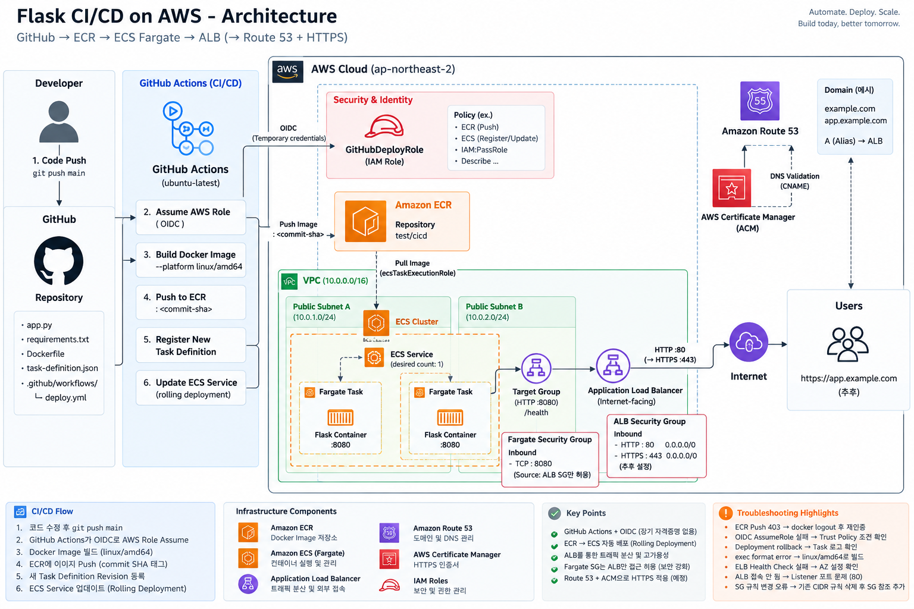

# CI/CD 배포 데모

## 개요
AWS ECS, Fargate, Github Action을 활용한 CI/CD 파이프라인 구축

## 배포 방법
Github Repo에 올린 소스를 github action을 활용해 AWS에 자동 배포

## 실행방법
http://cicd-test-alb-1935258983.ap-northeast-2.elb.amazonaws.com/
에 접속

## 아키텍쳐
